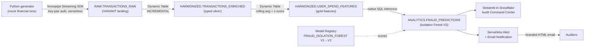
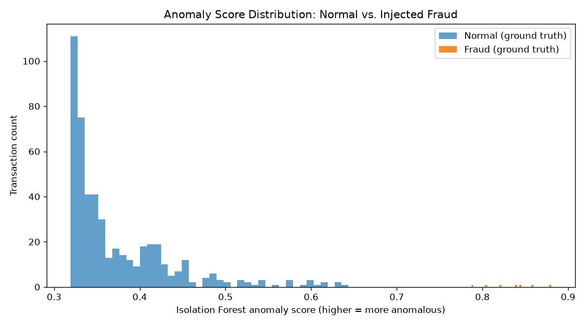

# Real-Time Fraud & Audit Pipeline — 100% Native on Snowflake

> An end-to-end, real-time fraud detection and audit platform built **entirely inside the Snowflake perimeter** — streaming ingestion, declarative transformation, native unsupervised ML, a governed dashboard, and automated email alerting. No external Kafka, no S3 landing bucket, no separate ML serving tier, no BI license, no orchestrator.


---

## The problem this solves

Enterprises running fraud detection on legacy stacks bleed money and trust in two places:

1. **Cloud-cost sprawl** — data is copied across a message bus, a landing bucket, an ETL cluster, an ML serving box, and a BI tool. Every hop is compute you pay for and infrastructure you operate.
2. **Governance fragmentation** — the moment data leaves the warehouse, lineage breaks, access controls diverge, and auditors can't answer "who touched this, when, and why."

**This project attacks both by keeping compute *and* governance where the data already lives.** Every component runs inside one Snowflake account, under one RBAC model, with one service identity. The result is sub-second fraud detection with a single, auditable trust boundary.

---

## Architecture



Everything above the auditor lives inside Snowflake. The only thing that "leaves" is an email notification.

---

## Tech stack & why each choice

| Layer | Technology | Why (vs. the legacy alternative) |
|---|---|---|
| **Ingestion** | Snowpipe Streaming (High-Performance Architecture, Python SDK) | Sub-second, **serverless** row-level ingestion — replaces Kafka + S3 staging + scheduled `COPY`. No warehouse burns credits during ingest. |
| **Transformation** | Dynamic Tables (medallion: RAW → silver → gold) | **Declarative** continuous pipelines — replaces Airflow/cron DAGs. You state freshness (`TARGET_LAG`); Snowflake manages incremental refresh and dependency ordering. |
| **ML** | Snowpark + scikit-learn Isolation Forest, Model Registry, Experiment Tracking | **Unsupervised** anomaly detection trained where the data lives; a governed, versioned model artifact; native SQL inference. No separate serving infrastructure. |
| **Application** | Streamlit-in-Snowflake (container runtime) | Governed dashboard **inside the perimeter** — no BI license, no data extract, inherits RBAC. |
| **Alerting** | Serverless Alerts + Email Notification Integration | **Push** governance — fraud escalates itself to auditors. No PagerDuty, no Lambda, no external scheduler. |
| **Governance** | RBAC (access roles + functional role), key-pair auth | Least-privilege throughout; one service identity for streaming, ML, and deploy. |

---

## How it works, phase by phase

1. **Environment & RBAC** — Two warehouses (workload isolation, 60s auto-suspend). A medallion database (`RAW`/`HARMONIZED`/`ANALYTICS`). A role model that separates **access roles** (object privileges) from a **functional role** (`FRAUD_ENGINEER`) — nothing is built as `ACCOUNTADMIN`.
2. **Transaction generator** — `transaction_generator.py` simulates a source system: 50 users each with a personal spending profile, plus ~1.5% injected anomalies (large spikes, foreign geography, card-not-present).
3. **Real-time ingestion** — `stream_transactions.py` streams rows directly into a two-column VARIANT landing table (mirroring Snowflake's Kafka-connector shape) via the Ingest SDK and key-pair auth. Serverless, sub-second.
4. **Declarative transformation** — Two chained Dynamic Tables flatten the VARIANT into typed columns, then compute per-user **rolling averages** and an **anomaly z-score**.
5. **Native ML** — An unsupervised Isolation Forest is trained via Snowpark, logged to **Experiment Tracking**, and registered in the **Model Registry**. Inference runs in pure SQL over the live gold table (`FRAUD_PREDICTIONS`).
6. **Audit Command Center** — A Streamlit-in-Snowflake app renders KPIs, a ranked anomaly worklist, and an anomaly-landscape chart, reading the live predictions view.
7. **Automated alerting** — A serverless Alert watches `FRAUD_PREDICTIONS` and emails auditors a Snowflake-branded HTML report when anomalies are flagged.

---

## The ML story: honest iteration (V1 → V2)

Real engineering means measuring and iterating, not shipping the first model.

| Model | Features | Precision | Recall | F1 | Verdict |
|---|---|---|---|---|---|
| **V1** | absolute `amount`, rolling avg/std, z-score | 0.50 | 0.71 | 0.59 | Underperformed a plain z-score rule — flagged big *spenders* as fraud |
| **V2** | **user-relative** z-score + `amount/rolling_avg` ratio | **0.875** | **1.00** | **0.93** | Caught **all** anomalies, incl. a cold-start case the z-score rule missed |

**Key insight:** fraud is relative to *each user's* norm, not an absolute dollar amount. The `AMOUNT_TO_AVG_RATIO` feature also degrades gracefully at cold-start (needs only 1 prior transaction vs. 2 for a z-score's standard deviation), catching fraud on a user's second-ever transaction. V2 was promoted to the registry's `DEFAULT` version; V1 is retained for auditability and rollback (champion-challenger).



---

## Repository layout

```
.
├── README.md
├── requirements.txt
├── generate_keys.py            # RSA key-pair for Snowflake key-pair auth (no OpenSSL needed)
├── transaction_generator.py    # source-system simulator (Faker)
├── stream_transactions.py      # Snowpipe Streaming client
├── snowpark_session.py         # Snowpark session via the same key-pair
├── train_fraud_model.py        # train → evaluate → experiment-track → register
├── sql/
│   ├── 01_setup_and_rbac.sql   # warehouses, schemas, roles, grants
│   ├── 02_streaming_landing.sql# VARIANT landing table
│   ├── 03_dynamic_tables.sql   # silver + gold Dynamic Tables
│   ├── 04_ml_inference_view.sql# native SQL inference view
│   └── 05_alerting.sql         # email integration + serverless alert
└── audit_app/
    ├── streamlit_app.py        # Streamlit-in-Snowflake Audit Command Center
    └── snowflake.yml           # infrastructure-as-code deploy manifest
```

---

## Reproduce it

**Prerequisites:** a Snowflake account, Python 3.11, and the Snowflake CLI (`snow`) for the app deploy.

```bash
# 1. Python environment
python -m venv venv && ./venv/Scripts/Activate.ps1   # Windows
pip install -r requirements.txt

# 2. Snowflake setup (run in a Snowsight worksheet, in order)
#    sql/01_setup_and_rbac.sql   (edit <YOUR_USER>)
#    sql/02_streaming_landing.sql

# 3. Key-pair auth
python generate_keys.py
#    then: ALTER USER <YOUR_USER> SET RSA_PUBLIC_KEY='<printed public key>';

# 4. Stream data (edit ACCOUNT in stream_transactions.py)
python stream_transactions.py --count 500

# 5. Transform + ML  (sql/03 → train_fraud_model.py → sql/04)
python train_fraud_model.py

# 6. Deploy the dashboard (infrastructure-as-code)
cd audit_app && snow streamlit deploy --replace

# 7. Alerting: run sql/05_alerting.sql (edit <YOUR_VERIFIED_EMAIL>)
```

> **Secrets are never committed** — `keys/`, `*.p8`, and `profile.json` are git-ignored. In production you'd use a dedicated service user (e.g. `SVC_FRAUD_STREAM`) rather than a human account.

---

## Cost & governance highlights (the FinOps story)

- **Serverless ingestion** — Snowpipe Streaming charges per-GB ingested; no warehouse runs during streaming.
- **Serverless alerting** — the Alert uses managed compute, not a warehouse.
- **Auto-suspend everywhere** — warehouses suspend after 60s idle; Dynamic Tables are suspended when idle to stop refresh credits.
- **Workload isolation** — separate warehouses for the pipeline vs. the app enable clean cost attribution (chargeback).
- **One trust boundary** — RBAC, lineage, and access history are unified because data never leaves Snowflake.

---

## SnowPro Core concepts demonstrated

RBAC & role hierarchy (access vs. functional roles, future grants) · semi-structured data (`VARIANT`, `:`/`::`, `TYPEOF`) · Dynamic Tables (target lag, refresh modes, dependency graph) · Snowpipe Streaming (channels, offset tokens, serverless) · warehouses (auto-suspend/resume, sizing) · key-pair authentication · Model Registry & versioning · notification integrations & alerts · Streamlit-in-Snowflake.

---

## Future enhancements

- **New-only alerting** — add a time-window + dedup on `event_ts`/ingest time (see the commented pattern in `sql/05_alerting.sql`) so alerts fire only on newly arrived fraud.
- **Dedicated service user** for the streaming/ML identity (separation of human vs. machine).
- **Model monitoring** — track feature drift and score distribution over time via Snowflake ML Observability.
- **Multivariate features** — geo-velocity and device-fingerprint signals for richer detection.

---

## About

Built as a portfolio project focused on **data engineering and automation** — demonstrating an end-to-end, production-shaped data platform with real-time ingestion, declarative pipelines, native MLOps, and event-driven governance, all on Snowflake.
